# vevc


> [!IMPORTANT]
> Work In Progress


**vevc** is a high-speed video compression format, extending the high-efficiency, multi-resolution image format [veif](https://github.com/octu0/veif) (velocity image format) with Temporal DWT, Spatial 2D-DWT, and SIMD-optimized entropy coding.

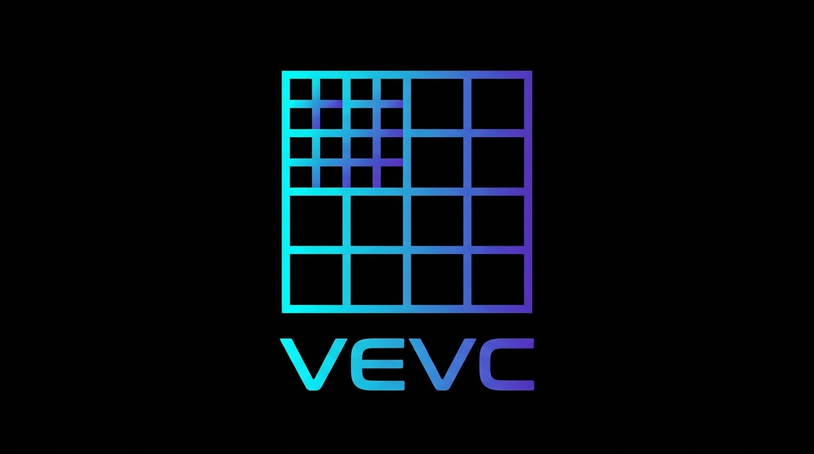

## Features

1. **Wavelet Domain Motion Compensation (WDMC) Architecture**
   - **Subband Motion Estimation**: `vevc` employs a hierarchical Wavelet Domain Motion Compensation (WDMC) pattern. Instead of predicting full-resolution pixel blocks, motion estimation works directly on reduced-resolution spatial frequency layers (Layer 0 HL, LH, HH domains), avoiding DWT-shift dependency while enabling lighting-fast sub-millisecond coarse-to-fine searches.
   - **Zero-Data Skip Blocks**: P-frame residuals are intelligently threshold-tested. Unchanged macroblocks have their transform coefficients completely nulled out at the encoder, yielding extreme entropy compression on structural backgrounds.
   - **Spatial DWT**: LeGall 5/3 2D-DWT with multi-resolution Layers (Layer 0, 1, 2) inherited from `veif`. I-frames and P-frame residuals are cleanly decomposed into spatial frequency layers.
   - **SIMD-Optimized Path**: Motion searches and DWT lifting are strictly unrolled without branches and optimized with `SIMD8<Int16>` vectorization for massively parallel pixel processing.

2. **Multi-Resolution Design**
   - At decode time, you can extract specific spatial resolutions from a single file depending on your needs. This enables flexible, highly efficient video delivery suited to network bandwidth and device capabilities without storing multiple video files.

   **Extraction Patterns (assuming a 1080p source):**

   | Target Use Case           | Spatial (`-maxLayer`) | Result Output            | Server-Side Action             |
   | :------------------------ | :-------------------- | :----------------------- | :----------------------------- |
   | **Max Quality (Archive)** | `2` (Layer 0,1,2)     | 1080p                    | No extraction (transfer as is) |
   | **Medium (Preview)**      | `1` (Layer 0,1)       | 540p                     | Skip Layer 2                   |
   | **Ultra Low (Thumbnail)** | `0` (Layer 0 only)    | 270p                     | Skip Layer 1, 2               |

3. **Acceleration via Concurrency & SIMD**
   - Temporal subband frames are encoded/decoded in parallel (4-way `TaskGroup`).
   - Spatial DWT, plane matching, shifting, and difference calculations are fully vectorized.
   - Temporal DWT lifting is SIMD8-optimized with scalar tail handling.

---

## Data Layout

`vevc` encodes video using Temporal GOP (Group of Pictures) of 4 frames, processed through a temporal-spatial wavelet pipeline.

**Bitstream Structure:**

```
                           VEVC File Structure
+-------------------+------------+-----------------+-----+-------------+
| Magic 'VEVC' (4B) | Metadata   | GOP (0..3)      | ... | GOP (tail)  |
+-------------------+------------+-----------------+-----+-------------+

    Metadata (Profile 2)
+---------------------------------------------+
| Metadata Size (2B) | Profile Version(1B)    |
+------------+-------+-----+------------------+----------+----------------+
| Width (2B) | Height (2B) | Color Gamut (1B) | FPS (2B) | Timescale (1B) |
+------------+-------------+------------------+----------+----------------+
| rANS Run 0 (256B)          | rANS Val 0 (256B)                          |
+----------------------------+--------------------------------------------+
| rANS Run 1 (256B)          | rANS Val 1 (256B)                          |
+----------------------------+--------------------------------------------+
| rANS DPCM Run (256B)       | rANS DPCM Val (256B)                       |
+----------------------------+--------------------------------------------+
  Color Gamut: 0x01=BT.709, 0x02=BT.2020
  Timescale:   0x00=1000ms, 0x01=90000hz

    Variable GOP (I-Frame followed by P-Frames up to keyint / scene change)
+---------------+-----------------+
| Data Size(4B) | GOP Size X (4B) |
+---------------+-----------------+-------------+--------------------+
| F0 len (4B)   | F0 (I-Frame)    | F1 len (4B) | F1 (P-Frame)       |
+---------------+-----------------+-------------+--------------------+
| F2 len (4B)   | F2 (P-Frame)    | F3 len (4B) | F3 (P-Frame)       | 
+---------------+-----------------+-------------+--------------------+

    Copy Frame (Duplicate Frame Skip):
    When Fn len == 0, the frame is a "copy frame" — pixel-identical to its
    predecessor. The encoder detects duplicate input frames (common in
    telecine/pulldown content, e.g. 24fps→60fps where ~60% are duplicates)
    and emits FrameLen=0 instead of encoding redundant data.
    The decoder reuses the previous reconstructed frame verbatim.

    Spatial Frame (Motion Vectors + 3 Layers structure)
    +-------------------------------------------------------------+
    | MVs Count (4B) | MV Data Len (4B)  | rANS Encoded MVs       |
    +----------------+-------------------+------------------------+
    | L0 len (4B)  | Layer 0 Payload (8x8 base)               |
    +--------------+------------------------------------------+
    | L1 len (4B)  | Layer 1 Payload (16x16 refinement)       |
    +--------------+------------------------------------------+
    | L2 len (4B)  | Layer 2 Payload (32x32 refinement)       |
    +--------------+------------------------------------------+

        Layer Payload
        +-------------+-----------+
        | qtY (2B)    | qtC (2B)  |
        +-------------+-----------+
        | Y len (4B)  | Y data    |
        +-------------+-----------+
        | Cb len (4B) | Cb data   |
        +-------------+-----------+
        | Cr len (4B) | Cr data   |
        +-------------+-----------+
```

---

## Performance

*(Tested with Tears of Steel 1080p, 1802 frames, target 500 kbps)*

### Speed & Size

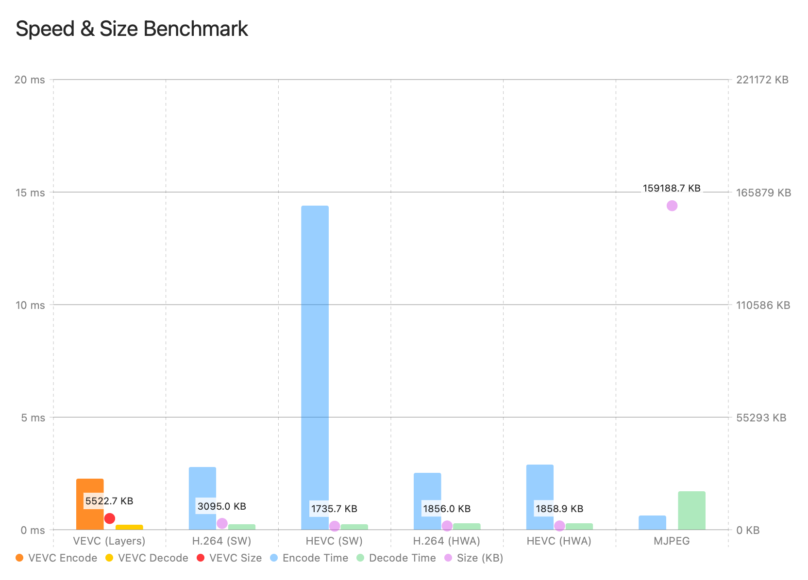

SW: Software, HWA: Hardware Acceleration

### PSNR

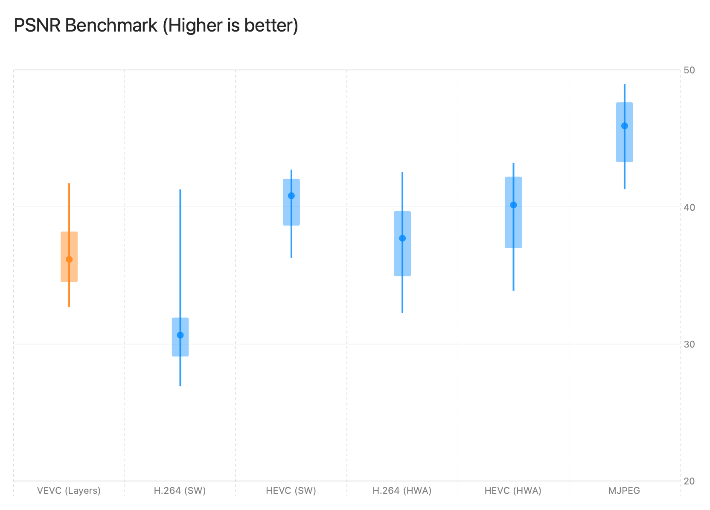

### SSIM

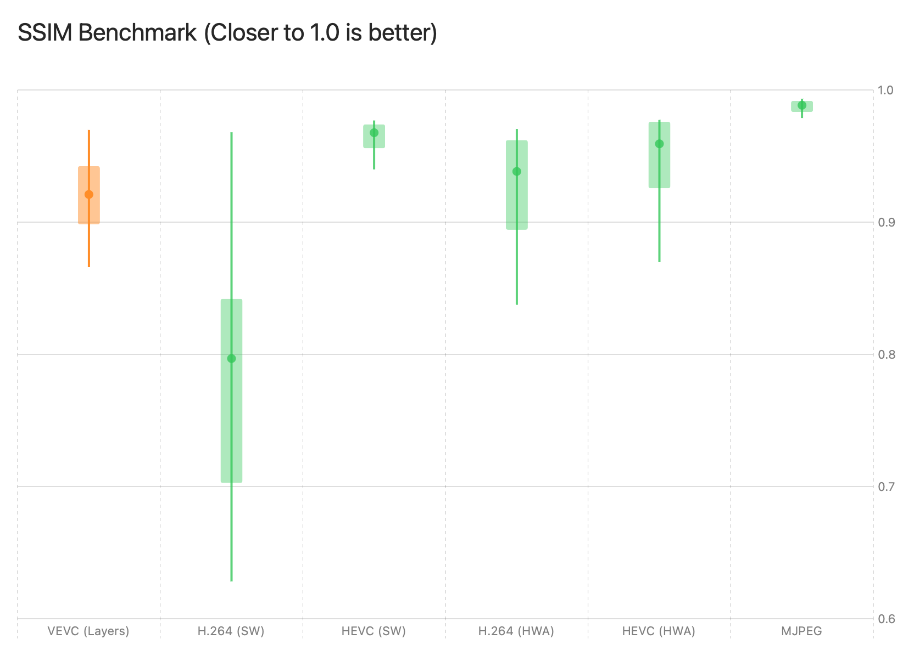

### Visual Quality Comparison

*(Crop 400x400 from Tears of Steel 1080p width)*

#### 1. Frame 1567 (VEVC Min SSIM)
| Original | VEVC | H.264(SW) | H.265(SW) |
|:---:|:---:|:---:|:---:|
| 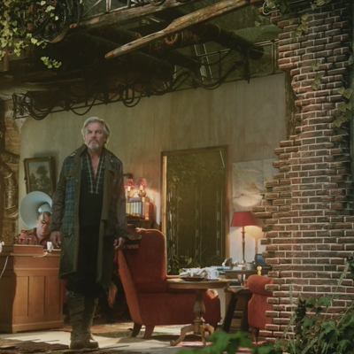 | 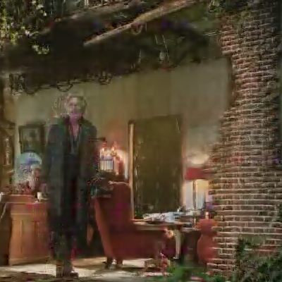 | 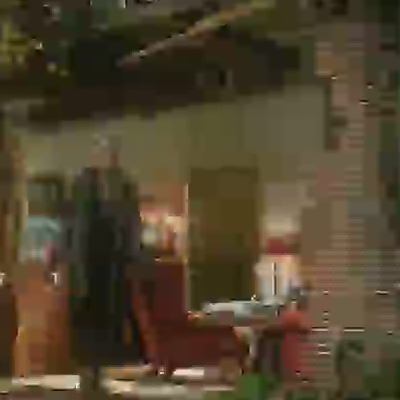 | 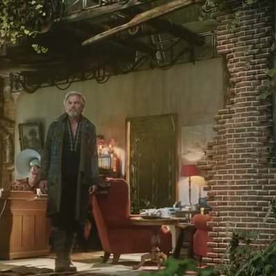 |

(CC) Blender Foundation | [mango.blender.org](https://mango.blender.org)

#### 2. Frame 1395 (H.264 Min SSIM)
| Original | VEVC | H.264(SW) | H.265(SW) |
|:---:|:---:|:---:|:---:|
| 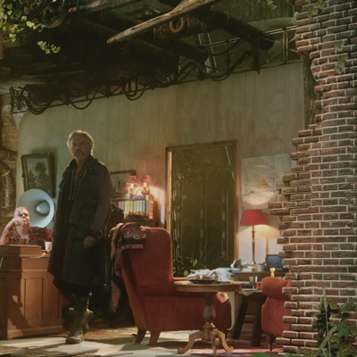 | 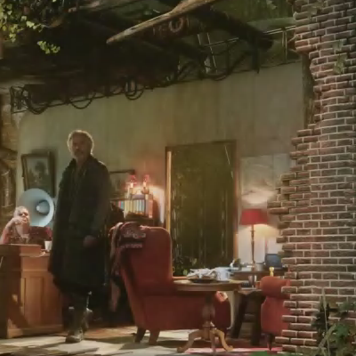 | 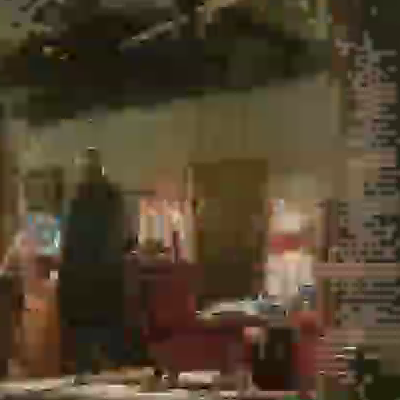 | 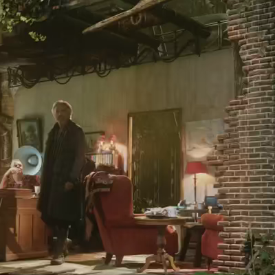 |

(CC) Blender Foundation | [mango.blender.org](https://mango.blender.org)

#### 3. Frame 1395 (H.265 Min SSIM)
| Original | VEVC | H.264(SW) | H.265(SW) |
|:---:|:---:|:---:|:---:|
|  |  |  |  |

(CC) Blender Foundation | [mango.blender.org](https://mango.blender.org)

#### 4. Frame 840 (14 seconds at 60fps)
| Original | VEVC | H.264(SW) | H.265(SW) |
|:---:|:---:|:---:|:---:|
|  |  |  |  |

(CC) Blender Foundation | [mango.blender.org](https://mango.blender.org)

---


## Entropy Coding: Interleaved rANS

`vevc` uses **Interleaved 4-way rANS (Asymmetric Numeral Systems)** for entropy coding. rANS provides near-optimal compression and enables SIMD-parallel decoding, unlike CABAC which is inherently serial.

### Architecture

```
DWT Coefficients
       │
       ▼
  Zero-Run RLE         ┌─── Raw Mode (≤32 non-zero coeffs)
  (run, value) pairs ──┤
       │               └─── rANS Mode  
       ▼                      │
  ValueTokenizer              ├── runModel (zero-run tokens)
  token + bypass bits         ├── valModel (value tokens)
       │                      └── 4-way Interleaved stream
       ▼
  Interleaved 4-way rANS Encoder
  (4 independent states, shared stream)
```

### Key Components

| File | Role |
|------|------|
| `rANS.swift` | Core rANS encoder/decoder, Interleaved 4-way variants, Bypass I/O, probability model with O(1) LUT |
| `EntropyCodec.swift` | `VevcEncoder` / `VevcDecoder`: Zero-Run RLE, raw fallback, compressed freq tables |
| `ValueTokenizer.swift` | Token/bypass decomposition for signed/unsigned values |
| `rANSCompressor.swift` | Standalone rANS compression for generic byte data |

### Hybrid Static/Dynamic Frequency Tables

`vevc` uses a hybrid approach for rANS frequency tables, selected per-stream based on data volume:

| Condition | Mode | Rationale |
|-----------|------|----------|
| Pair count ≥ 500 | **Dynamic** | Data-specific frequency tables provide 15–47% better compression |
| Pair count < 500 | **Static** | Pre-defined tables avoid ~400B header overhead that would exceed compression gains |

The encoder writes a `staticBit` flag in the stream header so the decoder knows whether to read embedded frequency tables or use the built-in static tables.

### Optimizations

- **Interleaved 4-way**: 4 independent rANS states decoded in round-robin, enabling future SIMD4 parallelism
- **O(1) Token Lookup**: 16384-entry LUT for instant cumulative-frequency → token resolution
- **Zero-Run RLE**: DWT zero coefficients compressed as run-length tokens
- **Raw Fallback**: Blocks with ≤32 non-zero coefficients skip rANS overhead entirely
- **Compressed Frequency Tables**: Bitmap-based encoding reduces table size from 32B to ~10B
- **Copy Frame Detection**: Duplicate input frames detected via SIMD16-accelerated pixel comparison, encoded as 4-byte markers

---

## CLI Usage

The `vevc` package includes command-line tools: `vevc-enc` (encoder) and `vevc-dec` (decoder).

### Encode (`vevc-enc`)

Takes a `y4m` format file as input and outputs the encoded `vevc` binary file. Standard Input (`-`) is also supported for piping.

```bash
$ swift run -c release vevc-enc -i input.y4m -o out.vevc
```

- `-i <path|->`: Specifies the input `.y4m` file path or standard input (`-`).
- `-o <path|->`: Specifies the output `.vevc` file path or standard output (`-`).
- `-b <kilobit>`: Specifies the target bitrate (desired compression ratio/quality) in kilobit per second.
- `-keyint <keyint>`: Specifies the keyframe interval (maximum GOP size, automatically falls back to I-Frame for scene changes or end of stream).
- `-zeroThreshold <threshold>`: Sets the threshold for treating DWT coefficients as zero (reduces size by aggressively skipping noise).
- `-sceneThreshold <sad>`: Sets the SAD threshold for scene change detection (forces an I-frame when temporal changes are too massive).

### Decode (`vevc-dec`)

Takes a `vevc` format file as input and outputs the decoded `y4m` video stream. Standard I/O (`-`) is also supported.

```bash
$ swift run -c release vevc-dec -i output.vevc -o output.y4m
```

**Multi-Resolution Options**:

- `-i <path|->`: Specifies the input `.vevc` file path or standard input (`-`).
- `-o <path|->`: Specifies the output `.y4m` file path or standard output (`-`).
- `-maxLayer <0-2>`: Specifies the maximum level of spatial layers to decode.
  - `0`: 1/4 size (for rough thumbnails)
  - `1`: 1/2 size (for previews)
  - `2`: Original size (default)

---

# Online DEMO

[vevc wasm demo](https://octu0.github.io/vevc-wasm-demo/)

## Internals

The core components of the implementation consist of the following files:

- `MotionEstimation`: SIMD-optimized hierarchical motion search directly operating on 2D DWT subbands for rapid P-frame prediction and Skip Block zeroing.
- `DWT`: Spatial LeGall 5/3 2D-DWT with SIMD-optimized lifting steps.
- `EncodePlane` / `DecodePlane`: The encode/decode pipeline applying spatial 2D-DWT, Wavelet Motion Compensation (MC), residual differencing, and entropy encoding.
- `Encoder` / `Decoder`: Video-level abstractions mapping dynamic GOP boundaries, scene change cut-offs, and bit rate approximations to planes.
- `rANS` / `EntropyCodec`: Interleaved 4-way rANS entropy coding engine with adaptive token-based probability modeling, O(1) LUT decoding, and raw fallback for sparse data.

## License

MIT
