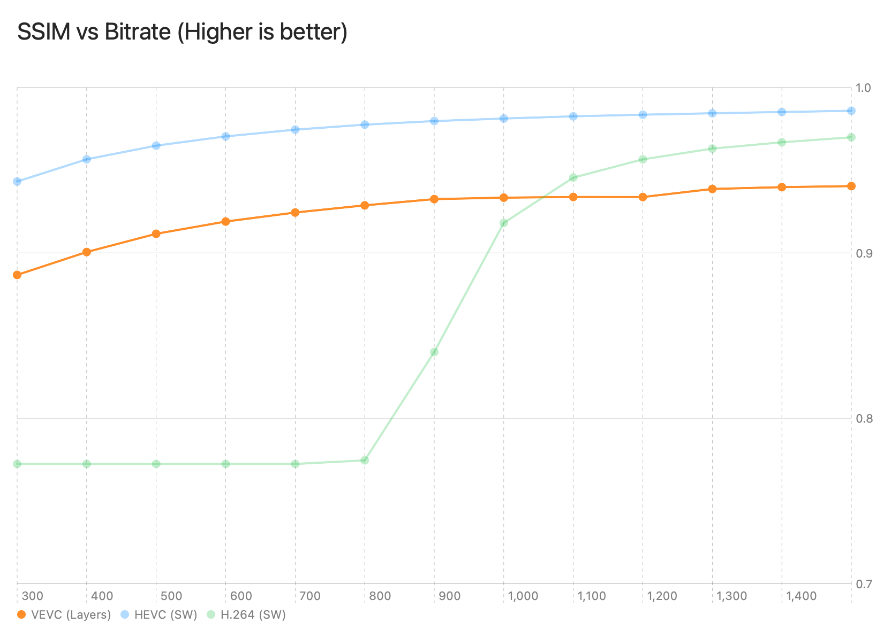
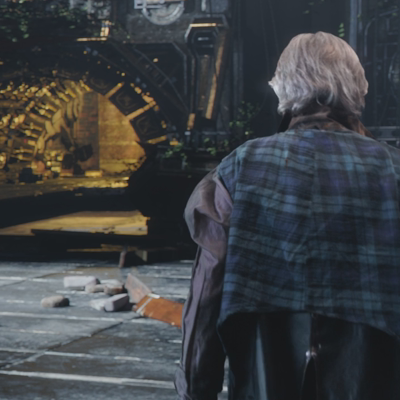
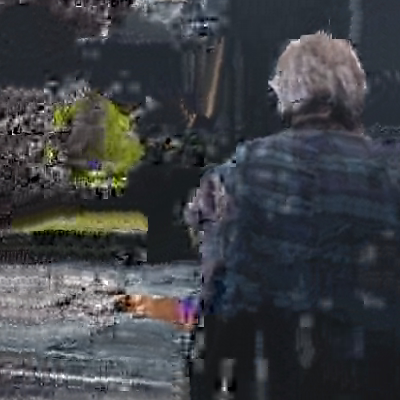
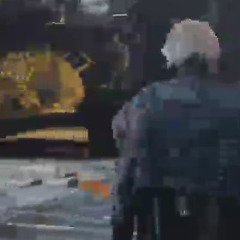

# vevc


> [!IMPORTANT]
> Work In Progress


**vevc** is a resolution-scalable, high-speed video codec designed to fundamentally solve the compute bottlenecks of modern adaptive bitrate (ABR) streaming.

Inspired by the spatial scalability philosophy of **JPEG 2000**, `vevc` reimagines this concept for modern video. It extends the high-efficiency image format [veif](https://github.com/octu0/veif) with Temporal DWT, Spatial 2D-DWT, and massively parallel SIMD-optimized entropy coding to achieve hardware-like speeds purely in software.


## The Vision: Zero-Transcoding Delivery

Modern video delivery platforms suffer from immense server-side CPU loads. To serve diverse clients seamlessly, servers must constantly decode and re-encode a single source stream into multiple resolutions (e.g., 1080p, 720p, 360p).

**`vevc` shifts the paradigm to "Encode Once, Route Anywhere."**
Because the video is natively encoded into hierarchical spatial frequency layers (DWT subbands), the delivery server **does not need to re-encode anything**. To serve a lower-resolution client, the server simply demuxes and drops the higher-frequency layer packets on the fly. This transforms a CPU-heavy transcoding pipeline into a lightweight network routing task—drastically slashing infrastructure costs.

## Features

### 1. Extractable Multi-Resolution Design
At decode or delivery time, specific spatial resolutions can be instantly extracted from a single `.vevc` file. This enables highly efficient video delivery suited to network bandwidth and device capabilities without storing multiple transcoded variants.

**Extraction Patterns (assuming a 1080p source):**

| Target Use Case           | Spatial (`-maxLayer`) | Result Output | Server-Side Action (CPU Cost: Near Zero) |
| :------------------------ | :-------------------- | :------------ | :--------------------------------------- |
| **Max Quality (Archive)** | `2` (Layer 0,1,2)     | 1080p         | None (Transfer bitstream as-is)          |
| **Medium (Preview)**      | `1` (Layer 0,1)       | 540p          | **O(1) Drop Layer 2 packets**            |
| **Ultra Low (Thumbnail)** | `0` (Layer 0 only)    | 270p          | **O(1) Drop Layer 1 & 2 packets**        |

### 2. Wavelet Domain Motion Compensation (Inspired by Dirac)
Combining Discrete Wavelet Transform (DWT) with motion compensation has historically been a monumental challenge, famously pioneered by the BBC's open video codec **Dirac**. `vevc` revives and modernizes this ambition:
- **Subband Motion Estimation**: Instead of predicting full-resolution pixel blocks, motion estimation operates directly on reduced-resolution spatial frequency domains (Layer 0 HL, LH, HH). This elegantly avoids traditional DWT shift-variance issues while enabling lightning-fast, sub-millisecond coarse-to-fine searches.
- **Zero-Data Skip Blocks**: P-frame residuals undergo strict structural threshold tests. Unchanged macroblock coefficients are aggressively nulled out at the encoder, pushing entropy compression to its limits on static backgrounds.
- **Spatial DWT**: Clean LeGall 5/3 2D-DWT decomposes I-frames and P-frame residuals, completely eliminating the blocking artifacts inherent in traditional DCT-based codecs (like AVC/HEVC).

### 3. Built for Massive Concurrency & SIMD
Where legacy wavelet codecs (like JPEG 2000's EBCOT) and modern DCT codecs (with CABAC) suffer from strictly serial bottlenecks, `vevc` is fundamentally architected for modern multi-core, SIMD-rich processors:
- **Multi-Threaded Pipeline**: Temporal subband frames and spatial code-blocks are completely decoupled. This data-agnostic structure allows the encoder and decoder to aggressively distribute workloads across multiple CPU threads without complex synchronization locks.
- **Vectorized Core Loops**: Spatial DWT lifting, plane matching, sub-pixel shifting, and residual calculations are strictly unrolled and fully vectorized using `SIMD8` and `SIMD16` for maximum ALU utilization.
- **Parallel Entropy Coding**: Bypassing the serial nature of traditional arithmetic coding, `vevc` employs a 4-way **Interleaved rANS (Asymmetric Numeral Systems)** coder. This guarantees high compression ratios while enabling simultaneous, multi-lane decoding.
---

## Performance

*(Tested with Tears of Steel 1080p, 1802 frames, target 500 kbps)*

### Speed & Size


SW: Software, HWA: Hardware Acceleration

### PSNR


### SSIM


### Bitrate vs SSIM



### Visual Quality Comparison

*(Crop 400x400 from Tears of Steel 1080p width)*

#### 1. Frame 417 (VEVC Min SSIM)
| Original | VEVC | H.264(SW) | H.265(SW) |
|:---:|:---:|:---:|:---:|
|  |  |  |  |

(CC) Blender Foundation | [mango.blender.org](https://mango.blender.org)

#### 2. Frame 1395 (H.264 Min SSIM)
| Original | VEVC | H.264(SW) | H.265(SW) |
|:---:|:---:|:---:|:---:|
|  |  |  |  |

(CC) Blender Foundation | [mango.blender.org](https://mango.blender.org)

#### 3. Frame 1395 (H.265 Min SSIM)
| Original | VEVC | H.264(SW) | H.265(SW) |
|:---:|:---:|:---:|:---:|
|  |  |  |  |

(CC) Blender Foundation | [mango.blender.org](https://mango.blender.org)

#### 4. Frame 840 (14 seconds at 60fps)
| Original | VEVC | H.264(SW) | H.265(SW) |
|:---:|:---:|:---:|:---:|
|  |  |  |  |

(CC) Blender Foundation | [mango.blender.org](https://mango.blender.org)

---


## Entropy Coding: Interleaved rANS

`vevc` uses **Interleaved 4-way rANS (Asymmetric Numeral Systems)** for entropy coding. rANS provides near-optimal compression and enables SIMD-parallel decoding, unlike CABAC which is inherently serial.

## Architecture & Internals

For codec researchers and developers, `vevc` features a modern, SIMD-optimized pipeline and a predictable bitstream layout.

### Entropy Coding: Interleaved rANS

```
DWT Coefficients
       │
       ▼
  Zero-Run RLE         ┌─── Raw Mode (≤32 non-zero coeffs)
  (run, value) pairs ──┤
       │               └─── rANS Mode  
       ▼                      │
  ValueTokenizer              ├── runModel (zero-run tokens)
  token + bypass bits         ├── valModel (value tokens)
       │                      └── 4-way Interleaved stream
       ▼
  Interleaved 4-way rANS Encoder
  (4 independent states, shared stream)
```

<details>
<summary><b>View VEVC Bitstream Data Layout</b> (Click to expand)</summary>

`vevc` encodes video using Temporal GOP (Group of Pictures) of 4 frames, processed through a temporal-spatial wavelet pipeline.
*Note: The encoder detects duplicate input frames (common in telecine content like 24fps in 60fps) and emits `FrameLen=0` instead of encoding redundant data, saving massive bitrate.*

**Bitstream Structure:**

```
                           VEVC File Structure
+-------------------+------------+-----------------+-----+-------------+
| Magic 'VEVC' (4B) | Metadata   | GOP (0..3)      | ... | GOP (tail)  |
+-------------------+------------+-----------------+-----+-------------+

    Metadata (Profile 1)
+---------------------------------------------+
| Metadata Size (2B) | Profile Version(1B)    |
+------------+-------+-----+------------------+----------+----------------+
| Width (2B) | Height (2B) | Color Gamut (1B) | FPS (2B) | Timescale (1B) |
+------------+-------------+------------------+----------+----------------+
| rANS Run 0 (256B)          | rANS Val 0 (256B)                          |
+----------------------------+--------------------------------------------+
| rANS Run 1 (256B)          | rANS Val 1 (256B)                          |
+----------------------------+--------------------------------------------+
| rANS DPCM Run (256B)       | rANS DPCM Val (256B)                       |
+----------------------------+--------------------------------------------+
  Color Gamut: 0x01=BT.709, 0x02=BT.2020
  Timescale:   0x00=1000ms, 0x01=90000hz

    Variable GOP (I-Frame followed by P-Frames up to keyint / scene change)
+-------------------+
| Frame Count (4B)  |
+-------------------+-------------+--------------------+--------------------+
| F0 (I-Frame)                    | F1 (P-Frame)       | F2 (P-Frame)       |
+---------------------------------+--------------------+--------------------+

    Spatial Frame Packet (Length-Value format)
    A delivery server can perform O(1) resolution scaling by simply dropping
    the trailing layer payloads without recalculating sizes.
    +--------------------------------------------------------------------------------------------------+
    | Status Flags (1B) (0x01: IsCopyFrame, 0x00: Normal)                                              |
    +---- IF NOT CopyFrame ----------------------------------------------------------------------------+
    | MVs Count (4B) | MVs Size (4B)    | RefDir Size (4B)                                             |
    +----------------+------------------+--------------------------------------------------------------+
    | Layer0 Size(4B)| Layer1 Size (4B) | Layer2 Size (4B)                                             |
    +----------------+------------------+--------------------------------------------------------------+
    | MVs Data Payload (MVs Size bytes)                                                                |
    +--------------------------------------------------------------------------------------------------+
    | RefDir Data Payload (RefDir Size bytes)   (Only for Bidirectional Frames)                        |
    +--------------------------------------------------------------------------------------------------+
    | Layer 0 Payload (Layer0 Size bytes)       (Base8: Thumbnail)                                     |
    +--------------------------------------------------------------------------------------------------+
    | Layer 1 Payload (Layer1 Size bytes)       (Level16: Preview)                                     |
    +--------------------------------------------------------------------------------------------------+
    | Layer 2 Payload (Layer2 Size bytes)       (Level32: Full Archive)                                |
    +--------------------------------------------------------------------------------------------------+

        Layer Payload
        +-------------+-----------+
        | qtY (2B)    | qtC (2B)  |
        +-------------+-----------+
        | Y len (4B)  | Y data    |
        +-------------+-----------+
        | Cb len (4B) | Cb data   |
        +-------------+-----------+
        | Cr len (4B) | Cr data   |
        +-------------+-----------+
```

</details>

### Aiming for Hardware/Silicon-Friendly by Design

While `vevc` currently achieves extreme speeds in software via SIMD, its foundational architecture is deliberately designed with future hardware acceleration (ASIC/FPGA/Mobile SoCs) in mind. By maintaining predictable data flows and minimizing complex logic, `vevc` provides a clean, silicon-friendly foundation:

- **Multiplier-Free Transforms**: The core LeGall 5/3 2D-DWT operates entirely using bit-shifts (`>>`) and additions/subtractions (`+`, `-`). By eliminating the need for large, power-hungry DSP multiplier blocks, the transform pipeline can achieve high clock frequencies with a minimal thermal and silicon footprint.
- **Parallel-Ready Entropy Coding**: The Interleaved 4-way rANS structure is naturally suited for parallel hardware execution. Hardware implementations can instantiate four independent, lightweight ALUs side-by-side. The O(1) decoding LUTs fit cleanly into tiny on-chip SRAMs (~32KB), breaking the strict serial dependency chains found in traditional arithmetic coders.
- **Localized SRAM Footprint**: `vevc` strictly confines its spatial DWT operations to independent 32x32 code-blocks. This ensures that the working set (approx. 2KB per block) remains entirely within fast, on-chip L1 scratchpad memory, bypassing the massive line-buffer requirements of traditional full-frame wavelet transforms.
- **Predictable Data Paths**: With a fixed block hierarchy (32x32 → 16x16 → Base8) and streamlined prediction modes, the datapath is highly deterministic. This allows RTL designers to build deep, efficient, feed-forward pipelines without unpredictable branching or overly complex state machines.
- **Reduced Memory Bandwidth**: Wavelet Domain Motion Compensation (WDMC) performs motion searches and compensation on reduced-resolution subbands. This inherently reduces the volume of reference pixel data that must be fetched from external DRAM, directly contributing to lower power consumption on mobile devices.

### Hybrid Static/Dynamic Frequency Tables

`vevc` uses a hybrid approach for rANS frequency tables, selected per-stream based on data volume:

| Condition | Mode | Rationale |
|-----------|------|----------|
| Pair count ≥ 500 | **Dynamic** | Data-specific frequency tables provide 15–47% better compression |
| Pair count < 500 | **Static** | Pre-defined tables avoid ~400B header overhead that would exceed compression gains |

The encoder writes a `staticBit` flag in the stream header so the decoder knows whether to read embedded frequency tables or use the built-in static tables.

### Optimizations

- **Interleaved 4-way**: 4 independent rANS states decoded in round-robin, enabling future SIMD4 parallelism
- **O(1) Token Lookup**: 16384-entry LUT for instant cumulative-frequency → token resolution
- **Zero-Run RLE**: DWT zero coefficients compressed as run-length tokens
- **Raw Fallback**: Blocks with ≤32 non-zero coefficients skip rANS overhead entirely
- **Compressed Frequency Tables**: Bitmap-based encoding reduces table size from 32B to ~10B
- **Copy Frame Detection**: Duplicate input frames detected via SIMD16-accelerated pixel comparison, encoded as 4-byte markers

---

## CLI Usage

The `vevc` package includes command-line tools: `vevc-enc` (encoder) and `vevc-dec` (decoder).

### Encode (`vevc-enc`)

Takes a `y4m` format file as input and outputs the encoded `vevc` binary file. Standard Input (`-`) is also supported for piping.

```bash
$ swift run -c release vevc-enc -i input.y4m -o out.vevc
```

- `-i <path|->`: Specifies the input `.y4m` file path or standard input (`-`).
- `-o <path|->`: Specifies the output `.vevc` file path or standard output (`-`).
- `-b <kilobit>`: Specifies the target bitrate (desired compression ratio/quality) in kilobit per second.
- `-keyint <keyint>`: Specifies the keyframe interval (maximum GOP size, automatically falls back to I-Frame for scene changes or end of stream).
- `-zeroThreshold <threshold>`: Sets the threshold for treating DWT coefficients as zero (reduces size by aggressively skipping noise).
- `-sceneThreshold <sad>`: Sets the SAD threshold for scene change detection (forces an I-frame when temporal changes are too massive).

### Decode (`vevc-dec`)

Takes a `vevc` format file as input and outputs the decoded `y4m` video stream. Standard I/O (`-`) is also supported.

```bash
$ swift run -c release vevc-dec -i output.vevc -o output.y4m
```

**Multi-Resolution Options**:

- `-i <path|->`: Specifies the input `.vevc` file path or standard input (`-`).
- `-o <path|->`: Specifies the output `.y4m` file path or standard output (`-`).
- `-maxLayer <0-2>`: Specifies the maximum level of spatial layers to decode.
  - `0`: 1/4 size (for rough thumbnails)
  - `1`: 1/2 size (for previews)
  - `2`: Original size (default)

---

# Online DEMO

[vevc wasm demo](https://octu0.github.io/vevc-wasm-demo/)

## License

MIT
