# vevc

<h1 align="center" style="border-bottom: none">
    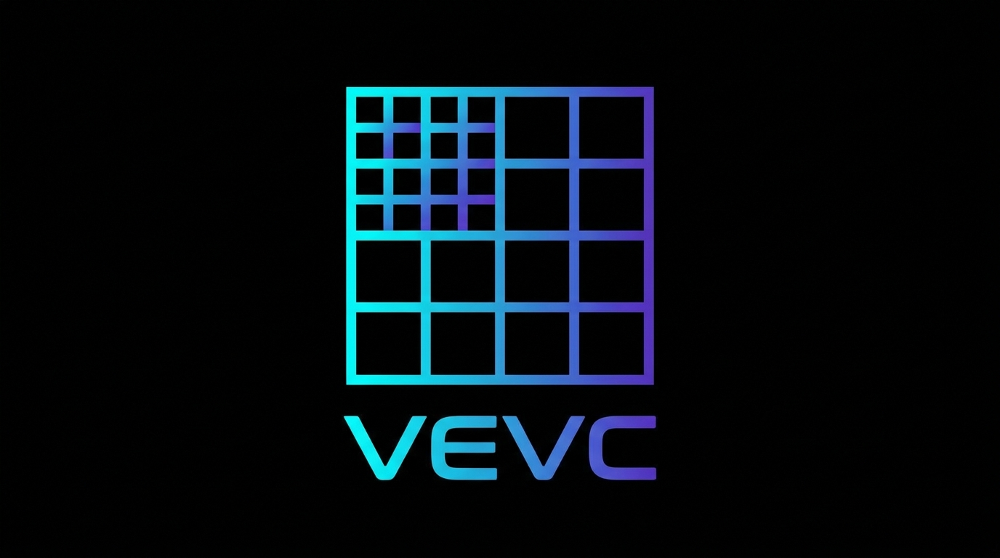
</h1>

> [!IMPORTANT]
> Work In Progress


**vevc** is a resolution-scalable, high-speed video codec designed to fundamentally solve the compute bottlenecks of modern adaptive bitrate (ABR) streaming.

Inspired by the spatial scalability philosophy of **JPEG 2000**, `vevc` reimagines this concept for modern video. It extends the high-efficiency image format [veif](https://github.com/octu0/veif) with Motion-Compensated Temporal Prediction, Spatial 2D-DWT, and massively parallel SIMD-optimized entropy coding to achieve hardware-like speeds purely in software.

## The Vision: Zero-Transcoding Delivery

Modern video delivery platforms suffer from immense server-side CPU loads. To serve diverse clients seamlessly, servers must constantly decode and re-encode a single source stream into multiple resolutions (e.g., 1080p, 720p, 360p).

**`vevc` shifts the paradigm to "Encode Once, Route Anywhere."**
Because the video is natively encoded into hierarchical spatial frequency layers (DWT subbands), the delivery server **does not need to re-encode anything**. To serve a lower-resolution client, the server simply demuxes and drops the higher-frequency layer packets on the fly. This transforms a CPU-heavy transcoding pipeline into a lightweight network routing task—drastically slashing infrastructure costs.

## Features

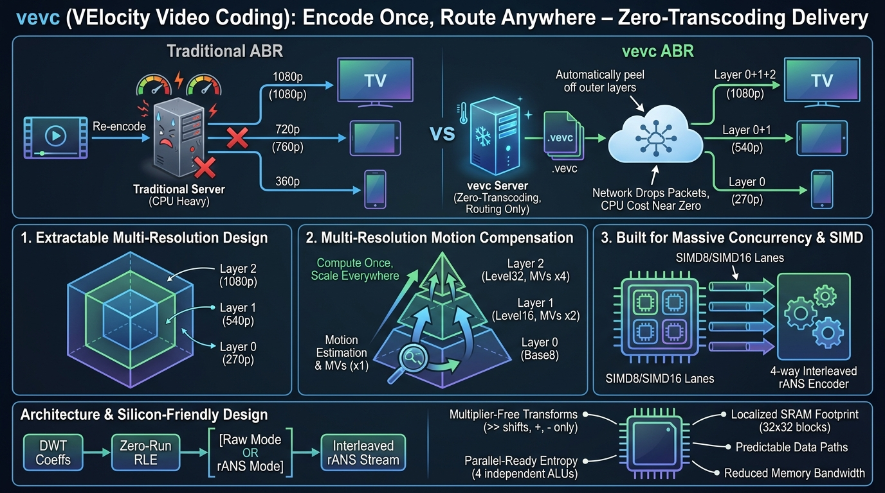

### 1. Extractable Multi-Resolution Design
At decode or delivery time, specific spatial resolutions can be instantly extracted from a single `.vevc` file. This enables highly efficient video delivery suited to network bandwidth and device capabilities without storing multiple transcoded variants.

**Extraction Patterns (assuming a 1080p source):**

| Target Use Case           | Spatial (`-max-layer`) | Result Output | Server-Side Action (CPU Cost: Near Zero) |
| :------------------------ | :-------------------- | :------------ | :--------------------------------------- |
| **Max Quality (Archive)** | `2` (Layer 0,1,2)     | 1080p         | None (Transfer bitstream as-is)          |
| **Medium (Preview)**      | `1` (Layer 0,1)       | 540p          | **O(1) Drop Layer 2 packets**            |
| **Ultra Low (Thumbnail)** | `0` (Layer 0 only)    | 270p          | **O(1) Drop Layer 1 & 2 packets**        |

### 2. Multi-Resolution Motion Compensation
Building on the spatial scalability of DWT, `vevc` performs **motion estimation once at the base (Layer 0) resolution** and scales the resulting Motion Vectors for each spatial tier:
- **Layer 0 (Base8, ×1)**: MVs used as-is, with 8×8 Luma / 4×4 Chroma blocks.
- **Layer 1 (Level16, ×2)**: MVs scaled 2×, with 16×16 Luma / 8×8 Chroma blocks.
- **Layer 2 (Level32, ×4)**: MVs scaled 4×, with 32×32 Luma / 16×16 Chroma blocks.

This **"Compute Once, Scale Everywhere"** strategy eliminates redundant motion estimation at higher resolutions. Each resolution tier independently performs motion compensation, meaning a server dropping Layer 2 and Layer 1 does not break P-frame prediction—Layer 0 alone is fully self-contained.
- **Subband Motion Estimation**: Motion estimation operates directly on reduced-resolution spatial frequency domains (Layer 0), combining Diamond Search with half-pixel refinement for sub-millisecond coarse-to-fine searches.
- **Zero-Data Skip Blocks**: P-frame residuals undergo strict structural threshold tests. Unchanged macroblock coefficients are aggressively nulled out at the encoder, pushing entropy compression to its limits on static backgrounds.
- **Spatial DWT**: Clean LeGall 5/3 2D-DWT decomposes I-frames and P-frame residuals, completely eliminating the blocking artifacts inherent in traditional DCT-based codecs (like AVC/HEVC).

### 3. Built for Massive Concurrency & SIMD
Where legacy wavelet codecs (like JPEG 2000's EBCOT) and modern DCT codecs (with CABAC) suffer from strictly serial bottlenecks, `vevc` is fundamentally architected for modern multi-core, SIMD-rich processors:
- **Multi-Threaded Pipeline**: Temporal subband frames and spatial code-blocks are completely decoupled. This data-agnostic structure allows the encoder and decoder to aggressively distribute workloads across multiple CPU threads without complex synchronization locks.
- **Vectorized Core Loops**: Spatial DWT lifting, plane matching, sub-pixel shifting, and residual calculations are strictly unrolled and fully vectorized using `SIMD8` and `SIMD16` for maximum ALU utilization.
- **Parallel Entropy Coding**: Bypassing the serial nature of traditional arithmetic coding, `vevc` employs a 4-way **Interleaved rANS (Asymmetric Numeral Systems)** coder with a unified 6-context model per plane. This guarantees high compression ratios while enabling simultaneous, multi-lane decoding.
---

## Performance

*(Tested with Tears of Steel 1080p, 1802 frames, target 500 kbps)*
*(SW: Software, HWA: Hardware Acceleration)*

### Speed & Size

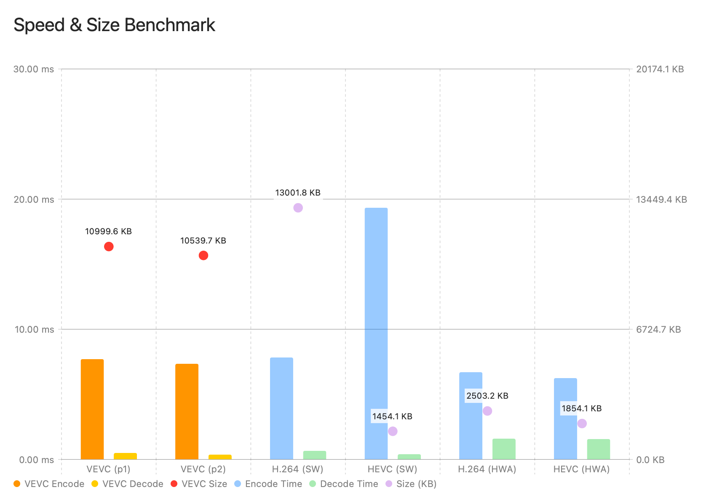

#### Profile 1

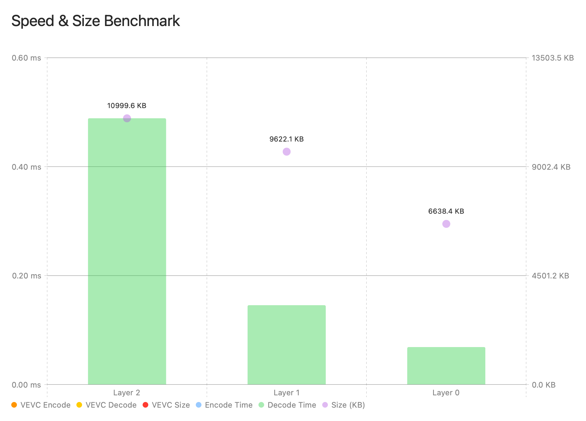

#### Profile 2

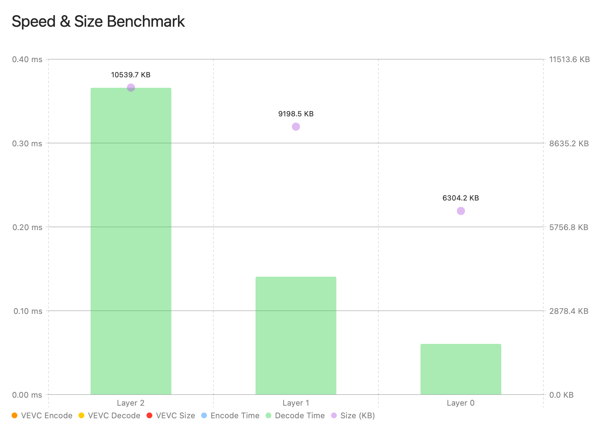


### PSNR

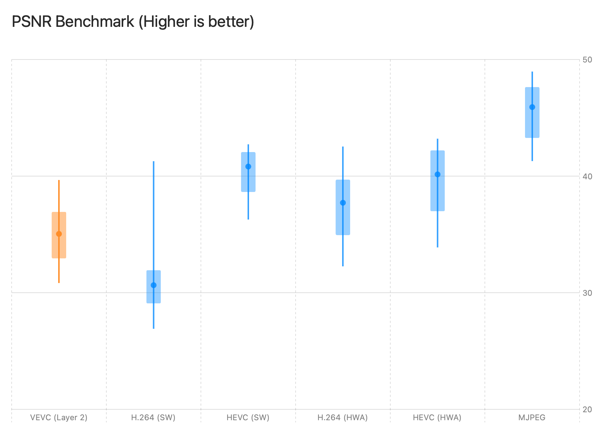

### SSIM

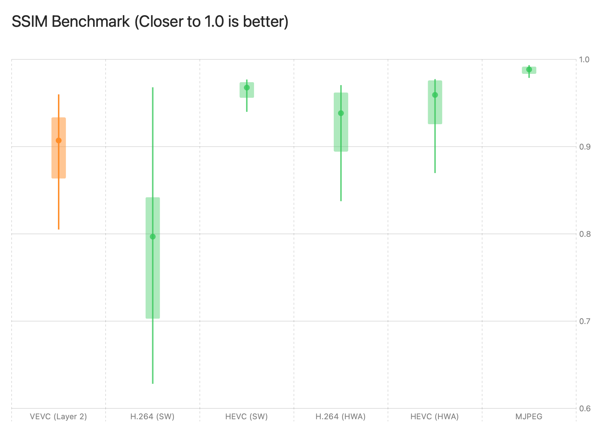

### Bitrate vs SSIM

#### Profile 1

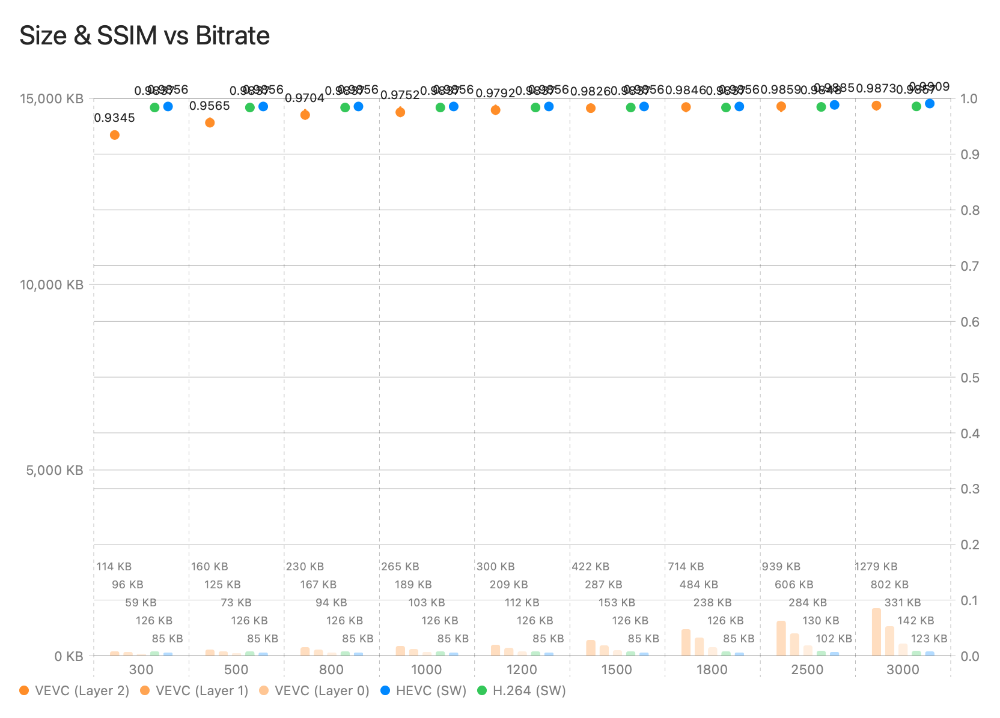

#### Profile 2

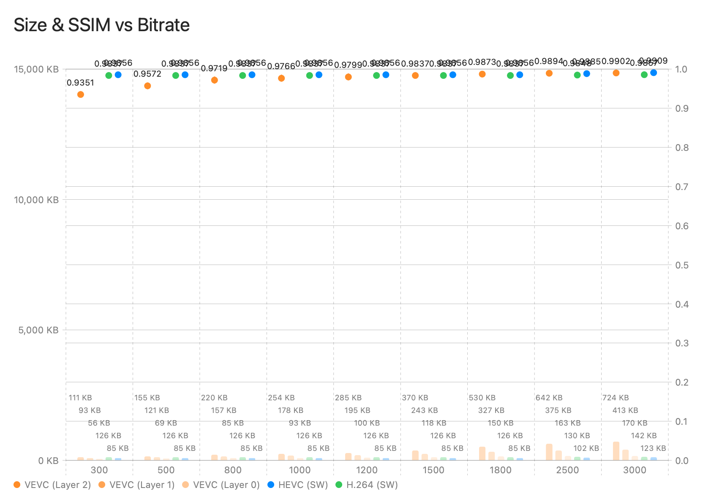

### Visual Quality Comparison

*(Crop 400x400 from Tears of Steel 1080p width)*

#### 1. Frame 1542 (VEVC Min SSIM)
| Original | VEVC | H.264(SW) | H.265(SW) |
|:---:|:---:|:---:|:---:|
| 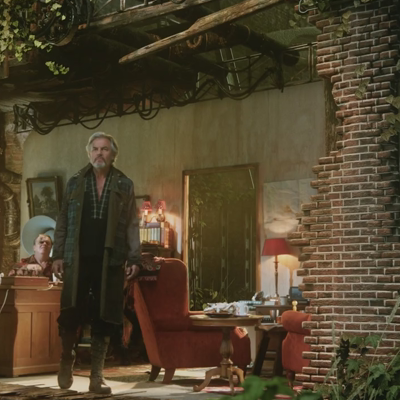 | 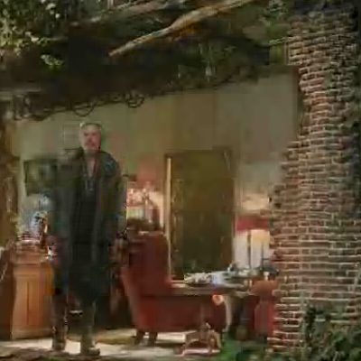 | 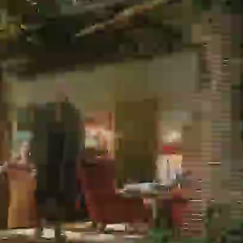 | 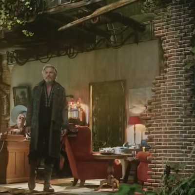 |

(CC) Blender Foundation | [mango.blender.org](https://mango.blender.org)

#### 2. Frame 1395 (H.264 Min SSIM)
| Original | VEVC | H.264(SW) | H.265(SW) |
|:---:|:---:|:---:|:---:|
|  |  | 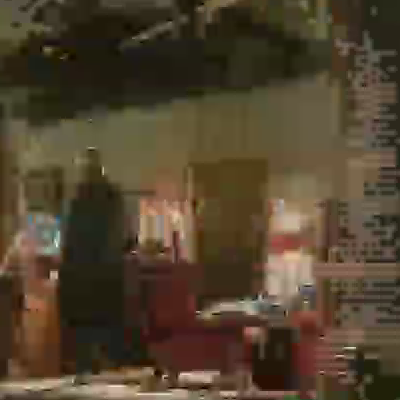 |  |

(CC) Blender Foundation | [mango.blender.org](https://mango.blender.org)

#### 3. Frame 788 (H.265 Min SSIM)
| Original | VEVC | H.264(SW) | H.265(SW) |
|:---:|:---:|:---:|:---:|
|  |  |  |  |

(CC) Blender Foundation | [mango.blender.org](https://mango.blender.org)

#### 4. Frame 420 (14 seconds at 60fps)
| Original | VEVC | H.264(SW) | H.265(SW) |
|:---:|:---:|:---:|:---:|
| 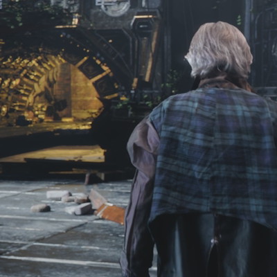 | 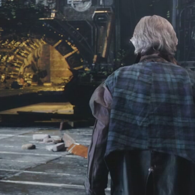 |  |  |

(CC) Blender Foundation | [mango.blender.org](https://mango.blender.org)

---


## Architecture & Internals

For codec researchers and developers, `vevc` features a modern, SIMD-optimized pipeline and a predictable bitstream layout.

### Entropy Coding: Interleaved rANS

```
DWT Coefficients
       │
       ▼
  Zero-Run RLE         ┌─── Raw Mode (≤32 non-zero coeffs)
  (run, value) pairs ──┤
       │               └─── rANS Mode  
       ▼                      │
   ValueTokenizer              ├── runModel (zero-run tokens)
   token + bypass bits         ├── valModel (value tokens)
        │                      ├── 6 contexts (AC×4 + DPCM + LSCP)
        ▼                      └── 4-way Interleaved stream
  Interleaved 4-way rANS Encoder
  (4 independent states, shared stream)
```

<details>
<summary><b>View VEVC Bitstream Data Layout</b> (Click to expand)</summary>

`vevc` encodes video using Variable GOP (Group of Pictures) with configurable keyframe interval (`-keyint`), processed through a hybrid temporal-prediction and spatial-wavelet pipeline.
*Note: The encoder detects duplicate input frames (common in telecine content like 24fps in 60fps) and emits `CopyFrame` markers (1 byte) instead of encoding redundant data, saving massive bitrate.*

**Bitstream Structure:**

```
                           VEVC File Structure
+-------------------+------------+----------------+-----+----------------+
| Magic 'VEVC' (4B) | Metadata   | Frame Packet 0 | ... | Frame Packet N |
+-------------------+------------+----------------+-----+----------------+

    Metadata (Profile 1 / 2)
+---------------------------------------------+
| Metadata Size (2B) | Profile Version(1B)    |
+------------+-------+-----+------------------+----------+----------------+
| Width (2B) | Height (2B) | Color Gamut (1B) | FPS (2B) | Timescale (1B) |
+------------+-------------+------------------+----------+----------------+
| Table Flag (1B): 0x00=built-in, 0x01=custom tables follow               |
+--------------------------------------------------------------------------+
  Color Gamut: 0x01=BT.709 (0x02=BT.2020 reserved, not yet implemented)
  Timescale:   0x00=1000ms (0x01=90000hz reserved, not yet implemented)

    Frame Packets (stored sequentially until EOF; no per-GOP header.
    An I-Frame followed by P-Frames up to keyint / scene change forms a logical GOP)
+---------------------------------+--------------------+--------------------+
| F0 (I-Frame)                    | F1 (P-Frame)       | F2 (P-Frame)       |
+---------------------------------+--------------------+--------------------+

    Spatial Frame Packet (Length-Value format)
    A delivery server can perform O(1) resolution scaling by simply dropping
    the trailing layer payloads without recalculating sizes.
    +--------------------------------------------------------------------------------------------------+
    | Frame Status (1B) (lower 4 bits: 0x00=P, 0x01=Copy, 0x02=I; bit4: hasRefDir)                    |
    +---- IF NOT CopyFrame ----------------------------------------------------------------------------+
    | SkipMap Size(4B) (Prof2 ONLY) | MVs Size (4B) | RefDir Size (4B) | Layer0 (4B) | Layer1 (4B) | Layer2 (4B) |
    +--------------------------------------------------------------------------------------------------+
    | SkipMap Data Payload (SkipMap Size bytes) (Prof2 ONLY)                                           |
    +--------------------------------------------------------------------------------------------------+
    | MVs Data Payload (MVs Size bytes)                                                                |
    +--------------------------------------------------------------------------------------------------+
    | RefDir Data Payload (RefDir Size bytes)  (Only when hasRefDir bit is set)                        |
    +--------------------------------------------------------------------------------------------------+
    | Layer 0 Payload (Layer0 Size bytes)       (Base8: Thumbnail)                                     |
    +--------------------------------------------------------------------------------------------------+
    | Layer 1 Payload (Layer1 Size bytes)       (Level16: Preview)                                     |
    +--------------------------------------------------------------------------------------------------+
    | Layer 2 Payload (Layer2 Size bytes)       (Level32: Full Archive)                                |
    +--------------------------------------------------------------------------------------------------+

        Layer Payload
        +-------------+-----------+
        | qtY (2B)    | qtC (2B)  |
        +-------------+-----------+
        | Y len (VLQ) | Y data    |
        +-------------+-----------+
        | Cb len (VLQ)| Cb data   |
        +-------------+-----------+
        | Cr len (VLQ)| Cr data   |
        +-------------+-----------+
```

</details>

### Aiming for Hardware/Silicon-Friendly by Design

While `vevc` currently achieves extreme speeds in software via SIMD, its foundational architecture is deliberately designed with future hardware acceleration (ASIC/FPGA/Mobile SoCs) in mind. By maintaining predictable data flows and minimizing complex logic, `vevc` provides a clean, silicon-friendly foundation:

- **Multiplier-Free Transforms**: The core LeGall 5/3 2D-DWT operates entirely using bit-shifts (`>>`) and additions/subtractions (`+`, `-`). By eliminating the need for large, power-hungry DSP multiplier blocks, the transform pipeline can achieve high clock frequencies with a minimal thermal and silicon footprint.
- **Parallel-Ready Entropy Coding**: The Interleaved 4-way rANS structure is naturally suited for parallel hardware execution. Hardware implementations can instantiate four independent, lightweight ALUs side-by-side. The O(1) decoding LUTs fit cleanly into tiny on-chip SRAMs (~32KB), breaking the strict serial dependency chains found in traditional arithmetic coders.
- **Localized SRAM Footprint**: `vevc` strictly confines its spatial DWT operations to independent 32x32 code-blocks. This ensures that the working set (approx. 2KB per block) remains entirely within fast, on-chip L1 scratchpad memory, bypassing the massive line-buffer requirements of traditional full-frame wavelet transforms.
- **Predictable Data Paths**: With a fixed block hierarchy (32x32 → 16x16 → Base8) and streamlined prediction modes, the datapath is highly deterministic. This allows RTL designers to build deep, efficient, feed-forward pipelines without unpredictable branching or overly complex state machines.
- **Reduced Memory Bandwidth**: Multi-Resolution Motion Compensation performs motion searches and compensation on the base Layer 0 resolution, then scales MVs for higher layers. This inherently reduces the volume of reference pixel data that must be fetched from external DRAM, directly contributing to lower power consumption on mobile devices.

### Cost-Based Adaptive Frequency Tables

`vevc` uses a cost-based adaptive approach for rANS frequency table selection, evaluated per-subband by estimating the total bit cost (data + header overhead) for each option:

| Mode | Header Cost | When Selected |
|------|-------------|---------------|
| **Static 6-context** | 0 bytes | Pre-trained tables already fit the data well |
| **Dynamic 6-context** | ~48B × 12 tables | Data-specific tables provide enough compression gain to offset header cost |
| **Dynamic merged** | ~48B × 2 tables | All contexts share similar distributions; merged model reduces header by 75% |
| **Backward-adapted history** | 0 bytes | Profile 2 P-frames: tables rebuilt from previously decoded frames beat all header-bearing options |

The encoder automatically selects the mode that minimizes total encoded size for each plane stream. This replaces the previous fixed-threshold approach with a Shannon entropy-based cost estimation.

**Backward-Adaptive History Tables (Profile 2)**: Encoder and decoder both maintain per-stream (layer × plane) decayed token counts across P-frames (`acc = acc/2 + current`). Once primed, the encoder can signal "reuse history" (flags bit `0x20`) and transmit no frequency tables at all — the decoder rebuilds identical models from the tokens it already decoded. State resets at every I-frame, keeping random access intact. On live-streaming content this removes most per-frame table overhead (measured 4.5–6% total bitrate reduction at equal quality, and ~8% at deeply saturated low-bitrate settings combined with the saturation-gated quantizer below).

### σ-Normalized Adaptive Quantization (Profile 2)

SSIM is not MSE: its local form divides the error energy by the signal's local variance, so the same coded error is highly visible on flat blocks and masked on textured ones. The derivation vevc's AQ is built on:

```
SSIM(x, y) = [(2μxμy + C1)(2σxy + C2)] / [(μx² + μy² + C1)(σx² + σy² + C2)]

For a small coding error e = y − x that preserves the block mean (μy ≈ μx):

    1 − SSIM(x, x+e)  ≈  E[e²] / (2σx² + C2)        (first order)

⇒ perceptual weight of a block:      w_k = 1 / (2σ_k² + C2)
⇒ RD-optimal per-block multiplier:   λ_k = λ · (2σ_k² + C2)
```

High-variance blocks tolerate coarser quantization (masking); flat blocks do not. C2 = (0.03·255)² ≈ 58 on the 8-bit scale, so the effect only matters when σ² ≫ 58 — vevc classifies a block as textured at σ² ≥ 1600 (σ ≥ 40).

vevc signals ONE quantization step per layer, so per-block λ cannot change the step. It is expressed through the **encoder-side dead zone** instead: textured blocks quantize their layer-2/1 luma HL/LH/HH with the dead zone widened by 0.25 step (`qMidTextured`/`qHighTextured`), which drops only the coefficients near the dead-zone edge — exactly the masked ones — and the rate controller reinvests the freed bits across frames. The decoder dequantizes with the same signaled step and needs no knowledge of the per-block choice; the bitstream format is unchanged.

- **σ² source**: one stride-4 pass over the source luma per frame (`computeBlockActivityMap`), on the same ceil(w/32) grid as the skip map. The DWT subband energies are the same multi-scale quantity — the transform already computes what MS-SSIM normalizes by.
- **Saturation-ramped**: the dead-zone delta ramps with the qHigh saturation extension (zero at base step ≤ 2048, full at 4096). At non-saturated rates the widening removes detail SSIM notices (measured −0.0016 avg at 2500kbps unramped); ramped, non-saturated bitstreams are byte-identical to no-AQ.
- **Known limit — variance cannot separate text from texture**: HUD text strokes are high-variance yet unmasked. Full-step widening measured best on metrics (−16.6% size) but visibly eroded scoreboard text; the adopted 0.25-step delta leaves large stroke coefficients untouched. A cheap stroke-vs-noise discriminator would recover the remaining headroom.
- Measured (miko 1080p60 @500kbps, deep saturation): min-SSIM +0.0018, avg +0.0006 at −4.5% size; higher rates and film content bit-identical.

### Optimizations

- **Interleaved 4-way**: 4 independent rANS states decoded in round-robin, enabling future SIMD4 parallelism
- **Unified 6-Context Stream**: LL (DPCM), HL/LH/HH (AC), and LSCP coordinates share a single per-plane entropy stream with 6 contexts, eliminating 12 bytes of per-subband size prefixes
- **Headerless 4-way Parallel Boundaries**: Lane bounds (chunk starts) are dynamically reconstructed from the total pair entries, eliminating 16-byte fixed header overhead per subband.
- **VLQ Internal Fields**: Bypass sizes, coefficient counts, and pair entries are stored using Variable Length Quantities (VLQ) instead of fixed 4-byte integers
- **Built-in Static Tables**: File header uses a 1-byte Table Flag instead of embedding 2560 bytes of raw frequency tables
- **O(1) Token Lookup**: 16384-entry LUT for instant cumulative-frequency → token resolution
- **Zero-Run RLE**: DWT zero coefficients compressed as run-length tokens
- **Raw Fallback**: Blocks with ≤32 non-zero coefficients skip rANS overhead entirely
- **Compressed Frequency Tables**: Bitmap-based encoding reduces table size from 32B to ~10B
- **Copy Frame Detection**: Duplicate input frames detected via SIMD16-accelerated pixel comparison, encoded as 1-byte markers
- **Backward-Adaptive Entropy Tables**: Profile 2 P-frames can reuse rANS models rebuilt from decoded history (zero table headers, decoder stays in lockstep without signaling)
- **Saturation-Gated Quantization Range**: the qHigh (HH) cap ramps up to 2× only when the rate controller saturates (base step beyond 2048), lowering the achievable rate floor by ~7% without touching normal-rate quality or worst-frame structure (qMid/qLow are never extended)
- **σ-Normalized AQ (Profile 2)**: textured blocks (source-luma σ² ≥ 1600) widen their layer-2/1 luma dead zones by 0.25 step under saturation — SSIM's masking denominator 1/(2σ²+C₂) in closed form, encoder-side only (see the section above)
- **Chroma Residual Culling (Profile 2)**: Base8 luma blocks already had an SAD-gated whole-block clear, but Cb/Cr had no analog — measured ~2.5× luma's nonzero-block rate, making P-L0 chroma cost more than luma. Chroma blocks whose raw residual SAD falls under a qstep-proportional threshold are culled pre-DWT (saturation-gated: inert below layer-0 chroma step 128 real). miko1 @500k: −10% size at −0.16 dB PSNR / min-SSIM unchanged
- **Backward-Adaptive MV Tables + Temporal MV Prediction (Profile 2)**: the P-frame MV payload's dx/dy rANS models reuse decayed token history from previously coded frames (mode flag bit `0x80`), dropping the per-frame frequency-table header, and a third cost-selected prediction mode codes residuals against the previous frame's co-located MVs. miko1 @500k: −1.6% stream size at bit-identical quality
- **Parent-Free Entropy Contexts (Profile 2)**: AC coefficient contexts condition only on the previous coefficient, never on the parent layer — measured smaller streams under the backward-adaptive tables, and it decouples the 9 coefficient streams (3 layers × 3 planes) from each other
- **All-Layer Skip Bypass (Profile 2)**: skip blocks bypass the block read, DWT and quantization on the encoder and dequant/inverse-DWT on the decoder at every layer (bit-exact — their coefficients are zero by construction). On skip-heavy live content this is the difference between 11.4 and 9.4 ms/frame encode at 1080p60
- **Latency-Mode Parallel Entropy Decode (Profile 2)**: the 9 independent streams can entropy-decode concurrently for single-stream low-latency playback (−13% per-frame latency); GOP-parallel throughput decoding keeps the sequential order, which is faster when all cores are already busy

---

## CLI Usage

The `vevc` package includes command-line tools: `vevc-enc` (encoder) and `vevc-dec` (decoder).

### Encode (`vevc-enc`)

Takes a `y4m` format file as input and outputs the encoded `vevc` binary file. Standard Input (`-`) is also supported for piping.

```bash
$ swift run -c release vevc-enc -i input.y4m -o out.vevc
```

- `-i <path|->`: Specifies the input `.y4m` file path or standard input (`-`).
- `-o <path|->`: Specifies the output `.vevc` file path or standard output (`-`).
- `-b <kilobit> | --bitrate <kilobit>`: Target average bitrate in kbps (default: 500). The rate controller tracks `-b × 1.3` as its planning rate — the stream carries 3 decodable layers, and the specified value prices the full-resolution layer while the 1.3× allowance covers the lower layers. Measured tracking on 1080p60 live content: actual ≤ 1.32–1.36× of the specified value whenever the target is reachable. Very low targets clamp at the quantizer-limited minimum output size (content-dependent; ~2.8 Mbps on busy 1080p60 game footage) instead of honoring the target.
- `-qstep <val>`: CQP mode. Uses a constant quantization step, bypassing rate control.
- `-keyint <keyint>`: Specifies the keyframe interval (maximum GOP size, automatically falls back to I-Frame for scene changes or end of stream).
- `-zero-threshold <threshold>`: Sets the threshold for treating DWT coefficients as zero (reduces size by aggressively skipping noise).
- `-scene-threshold <sad>`: Raw per-pixel SAD trigger for scene changes (default 500 ≒ off; the range is 0–765). Independent of this trigger, the encoder detects hard cuts with a sign-mix test — a cut moves block means in both directions, a flash/fade in one — and emits an I-frame that keeps the periodic keyint grid. Setting the threshold above 765 disables both detectors (deterministic encodes).
- `-profile <0x01|0x02>`: Selects profile (`0x01` baseline, `0x02` P-skip/LTR + backward-adaptive entropy tables; default: `0x01`).
- `-gop <frames>`: Sets the LTR refresh interval for Profile 0x02 in frames (default: 12; 0 disables periodic LTR refresh).
- `-l2-cadence <n>`: Cadence interval for L2 detail residual in Profile 0x02 P-frames (default: 4; `0` disables L2 residual, `1` encodes every frame, `n >= 2` encodes when `framesSinceKeyframe % n == 0`).
- `-l1-cadence <n>`: Cadence interval for L1 detail residual in Profile 0x02 P-frames (default: 2; `0` disables L1 residual, `1` encodes every frame, `n >= 2` encodes when `framesSinceKeyframe % n == 0`).
- `-mvt <px>`: Motion masking threshold in px/frame (default: 2, 0 disables). Drops L2 high-frequency residual to reduce bitrate only when motion exceeds the Chebyshev norm ($\max(|dx|, |dy|) \ge \text{effectiveMvtQ}$, $\text{effectiveMvtQ} = \text{motionMaskingPx} \times 4 \times 60 / \text{framerate}$) and quantization is deep (`motionMaskingMinQStep <= adjustedStep`, default: 2048 or higher), while protecting high-activity texture blocks such as text and strokes. Details recover at the next cadence refresh (at most `l2-cadence` frames, default: 4 = 67ms @ 60fps). Recon validation prevents false capture into `skip_prev`.

### Decode (`vevc-dec`)

Takes a `vevc` format file as input and outputs the decoded `y4m` video stream. Standard I/O (`-`) is also supported.

```bash
$ swift run -c release vevc-dec -i output.vevc -o output.y4m
```

**Multi-Resolution Options**:

- `-i <path|->`: Specifies the input `.vevc` file path or standard input (`-`).
- `-o <path|->`: Specifies the output `.y4m` file path or standard output (`-`).
- `-max-layer <0-2>`: Specifies the maximum level of spatial layers to decode.
  - `0`: 1/4 size (for rough thumbnails)
  - `1`: 1/2 size (for previews)
  - `2`: Original size (default)
- `-max-frames <1|2|4>`: Specifies the maximum number of multi-threaded frames to decode concurrently (default: 4).

---

## C API (libvevc)

We provide a C interface for synchronously encoding and decoding frame by frame.
A fully buildable and runnable example is available in the [example/C](example/C) directory.

### Encoder Example

```c
#include <stdio.h>
#include <stdlib.h>
#include "encode.h"

int main() {
    vevc_enc_param_t param = {
        .width = 1920,
        .height = 1080,
        .maxbitrate = 1500,
        .framerate = 30,
        .zero_threshold = 3,
        .keyint = 60,
        .scene_change_threshold = 10,
        .max_concurrency = 4
    };

    VEVC_ENC enc = vevc_enc_create(&param);

    // Create and configure imgb
    vevc_enc_imgb_t imgb = {
        .y = y_buffer,
        .u = u_buffer,
        .v = v_buffer,
        .stride_y = 1920,
        .stride_u = 960,
        .stride_v = 960
    };

    vevc_enc_result_t* res = vevc_enc_encode(enc, &imgb);
    if (res->status == VEVC_OK && res->data != NULL) {
        // Process res->data (e.g., write to a file)
        // NOTE: The data pointer points to an internal buffer and is only valid until the next vevc_enc_* call.
        printf("Encoded frame size: %zu\n", res->size);
    }
    
    // Flush to push out remaining buffers (no B-frame delay in vevc)
    vevc_enc_result_t* f_res = vevc_enc_flush(enc);

    vevc_enc_destroy(enc);
    return 0;
}
```

### Decoder Example

```c
#include <stdio.h>
#include <stdlib.h>
#include "decode.h"

int main() {
    VEVC_DEC dec = vevc_dec_create(2, 4, 1920, 1080);

    // Decode chunk data
    vevc_dec_result_t* res = vevc_dec_decode(dec, chunk_data, chunk_size);
    if (res->status == VEVC_OK && res->y != NULL) {
        // Use res->y, res->u, res->v
        // NOTE: The pointers point to an internal buffer and are only valid until the next vevc_dec_* call.
        printf("Decoded frame size: %d x %d\n", res->width, res->height);
    }

    vevc_dec_destroy(dec);
    return 0;
}
```

### Go (CGO) Example

You can call the C API from Go using CGO. A complete, runnable example containing Go module configuration and memory pinning (`runtime.Pinner`) is located in the [example/Go](example/Go) directory.

---

# Online DEMO

[vevc wasm demo](https://octu0.github.io/vevc-wasm-demo/)

---

## License

MIT
